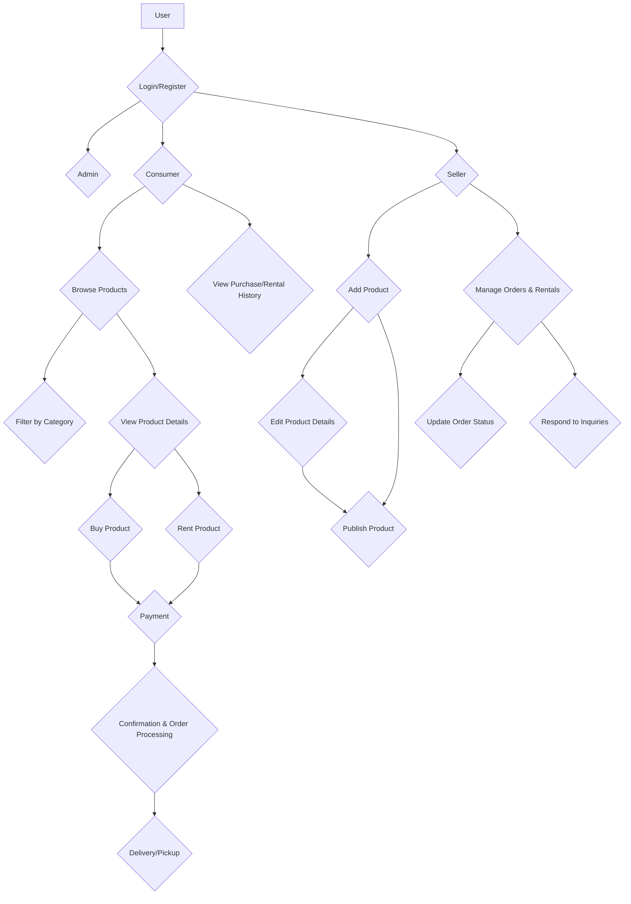
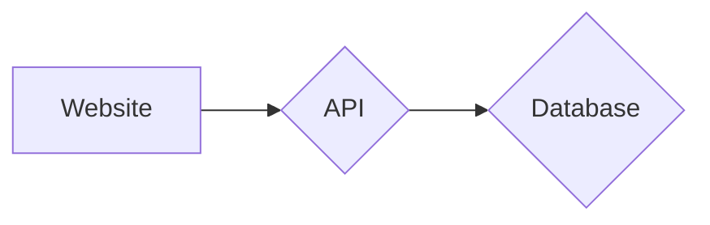

# Teebay
Traditionally, consumers have relied on physical marketplaces to connect with sellers. However, these markets often have limitations in terms of product availability and variety. Factors like distance and location can further restrict choices for consumers.

Online platforms offer a solution by bridging the gap between consumers and sellers. These platforms remove geographical barriers and provide access to a wider range of products, regardless of the user's location.

**Teebay,** for example, can be a platform where both consumers and sellers can come together. Consumers can browse and purchase a wider variety of products, while sellers can reach a broader audience.

## Goals

- Categorization of products providing easy access to intended products
- Bridging gap between consumer and seller irrespsective of distance
- Easy to use web application

## Project Overview

There will a web interface accessible for sellers and consumers where they can buy/sell or rent their products with minimal efforts.

## Stackholders

- Seller
- Consumer

## Types of users

- Admin
- Consumer
- Seller


A user can be a seller also. So, we can merge these 2 roles into one. Every account will have all the available options as like seller and buyer. But for documentaion purpose and separation of concern we can visualize it considering different entity.
## Features

### Common features for all user

- Login
- User Registration

### Consumer Features

- View list of available products of different categories
- Buy product
- Rent product
- View bought and rented products

### Seller Features

- Add products
- Edit product details
- Delete products

### Overall user flow

# Chapter-2 (System Design Document)

<center>
  

</center>

## Website
### Functional Requirements

- Consumer
  - View all products
  - Buy/Rent Product
  - View transaction history
- Seller
  - Add products with category
  - Edit product details
  - Delete product
  
### Non Functional Requirements
  - User registration
  - User login
  - Single Page application
  - Log transaction history with response code
  - Simple design
  
## API & DB
### Functional Requirements
  - Consumer
    - Get all products
    - Buy Product [authorization required]
    - Rent product [authorization required]
    - Get transaction history by userGuid [authorization required]

   - Seller [authorization required]
      - Add Product
      - Edit Product
      - Delete Product

   - Common
      - Login
      - Registration
  
### Non functional Requirements
  - API authorization
  - Ensure db transaction
  
# Chapter-3 (Software Design Document)
## Web
- Consumer
  - Product Card
- Seller
  - Form Element
  - Product Card
- Common
  - Login Form
  - Registration Form Element
  
## Web element description
### Product Card
  - Title
  - Category
  - Price [selling price | rent price]
  - Description
  - Delete button [required for seller]
  - Edit button [required for seller]

### Product form element
- Title
- Category
- Description
- Price

### Product Detail Component
Extends Product form element
- Rent [button]
- Buy [button]

### Login form element
- Email
- Password

### Registration form element
- First name
- Last name
- Address
- Email
- Phone
- Password
- Confirm password
## Routes
- View transactions [list of product cards for following routes]
  - route: [**/transaction**]
    - Bought
    - Rent
    - Sold

- My Products
  - route: [**/my-products**]
  - Component: Extended ProductComponent with following actions

    - Edit Product
      - route: [**/edit/:pvId**]
      - Component: ProductEditComponent

    - Delete Product
      - route: [**/delete/:pvId**]
      - Component: N/A

- Add Product
  - route: [**/add-product**]
  - Component: ProductFormComponent

- View all products
  - route: [**/products**]
  - Component: All Product Component [div of ProductComponent[]]
 
- Login
  - route: [**/login**]
  - Component: Login Form Component
  
- Register
  - route: [**/register**]
  - Registration Form Component
  
- Product details
  - route: [**/product/:pvId**]
  - Product Details Component
  
## API
### Endpoints
- **GET /product**
  - params [N/A]
  - Returns -> array of product model
  - Query plan
    ```sql
      SELECT * FROM [products]
    ```
- **GET /product/:{catId}**
  - params -> category id
  - Returns -> array of product models for specific category
  - Query plan
    ```sql
      SELECT * FROM [products]
        WHERE id = catId
     ```
- **POST /product**
  - params -> product model
  - Query plan
    ```sql
    INSERT INTO [product]
      VALUES (id, categoryId, title, description, sellingPrice, rent, ownerId)
  ```
- **PUT /product/:{id}** [Authorization required]
  - params -> product id
  - body -> [customerGuid]
  - Query plan
    ```sql
      UPDATE [product]
        SET [...]
        WHERE id = {id}
    ```
- **DELETE /product/:{id}** [Authorization required]
  - params -> product id
  - body -> [customerGuid]
  - Query Plan
      ```sql
      DELETE * from [product]
        WHERE id = id
      ```
- **GET /order** [Authorization Required]
  - params [N/A]
  - body [customerGuid]
  - Returns -> array of orders 
  - Query Plan
     ```sql
     SELECT * FROM [order]
      WHERE customerGuid = [customerGuid]
     ```
- **POST /order** [Authorization required]
  - params [N/A]
  - body [OrderModel]
  - Query Plan
    ```sql
    INSERT orderModel into INTO [order]
    ```
- **POST /register**
  - params -> N/A
  - body -> registration model
  - Query plan
    ```sql
    INSERT userModel into [users]
    ```
- **POST /login**
  - params -> N/A
  - body -> login credentials
  - returns -> user model
  - Query plan
    ```sql
    SELECT * from [users]
    where email = [user.email] and password = [user.pass]
    ```
    
## Database Design
- Customer
  - Id [auto increament]
  - CustomerGuid [primary key]
  - Email
  - Phone
  - Address
  - password (hashed)
  
- Product
  - Id [auto increament]
  - Owner [referenes CustomerGuid in Customer Table]
  - Title
  - Price
  - Renting Price
  - Description
  - Total Views
  - Published On
  - LastEditedOn [Date]
  - isDeleted [boolean]
  
- Category
  - id
  - name
  
- ProductCategory
  - id
  - productId [refers to Id field in `Product` table]
  - cateogry id [refers to Id field in `Category` table]
  
- Order
  - Id
  - CustomerGuid [referenes CustomerGuid in Customer Table]
  - Total Amount
  - PlacedOn [Date]

- OrderItems
  - Id
  - OrderId [references to Id in Order Table]
  - ProductId [references to Id in Product Table]
  - OrderType [rented or bought | can be a boolean field]
  - Rent Start Time
  - Rent End Time

**Note**: Problem with above schema arises if we want to fetch those orders which consisted rented and bought both type of products. In that case, we can't say an order fully bought or fully rented. Also, we didn't consider out of stock, overlapping rent period for the schema.

**Note2:** `isDeleted` field in Product table will represent if a product is deleted or not. We are considering `soft` delete because product id is referenced to other tables as well. So, we can't delete a product because of referential integrity and foreign key constraint. Also, we don't want to loose previous information about orders related to this product.

# Chapter-4 (Deliverable & Milestone)
## Milestone 1 [Complete FrontEnd]
- Day 1: Create Skeleton & Login form Completion
- Day 2: Registration Form completion, View all product, Product Detail page completion & Database Design
- Day 3: My Products, Edit Products, Add Products Completion
